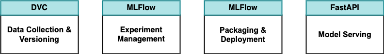
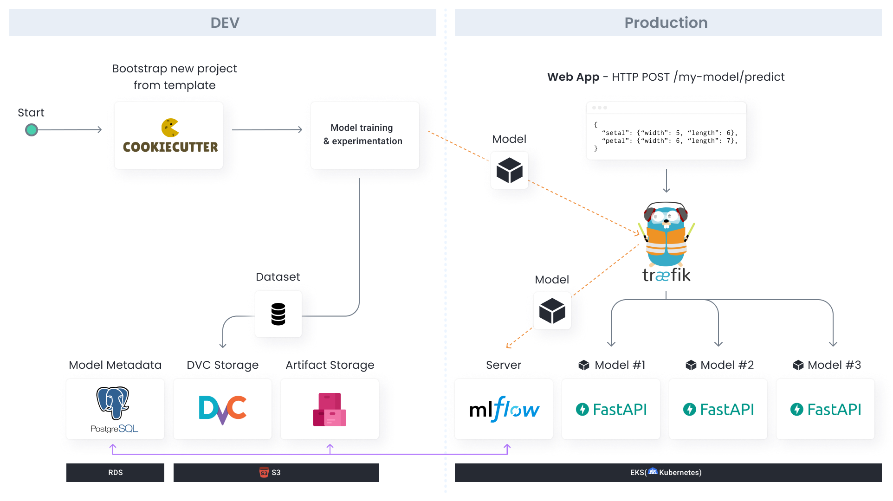

# Build-ML-Platform-from-scratch
- github : https://github.com/aporia-ai/mlplatform-workshop
- youtube : https://www.youtube.com/watch?v=s8Jj9gzQ3xA&t=1497s

## What features I implemented

## Architecture
